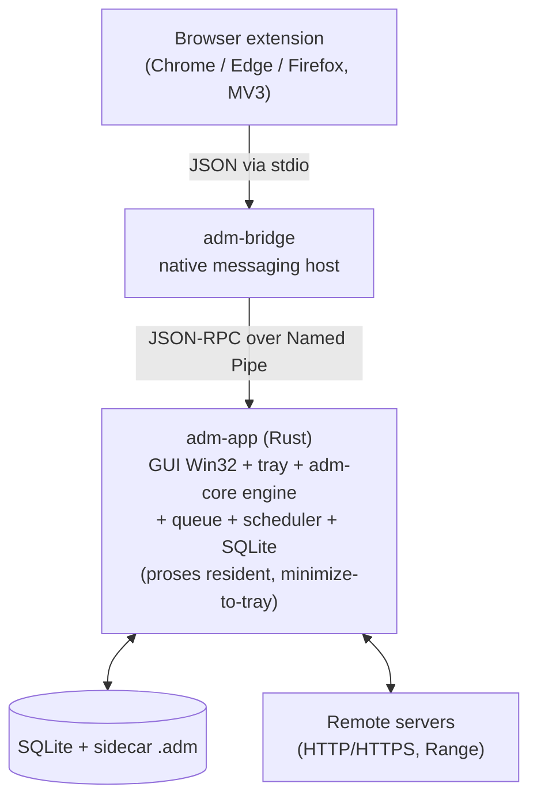

# ADM — Alpha Download Manager (Windows)
## Rencana Implementasi (Spesifikasi untuk Agent Pelaksana)

> **Status:** Plan v2.1 (Windows) — siap dieksekusi.
> **Perubahan v1.0 → v2.0:** (a) **default tech stack diganti ke full-Rust** (`windows-rs`/`nwg`) menggantikan C# WinForms — satu bahasa, satu toolchain, footprint terkecil, engine in-process; (b) **arsitektur disederhanakan** dari 3-binary + daemon terpisah menjadi **1 proses resident (`adm-app`) + 1 bridge kecil** dengan model *minimize-to-tray* ala IDM; (c) **protokol Named Pipe GUI↔daemon dihapus** (GUI↔engine sekarang in-process), pipe hanya dipakai jalur bridge↔app. C# WinForms turun jadi alternatif (§15.1).
> **Perubahan v2.0 → v2.1:** (d) **sistem 3 tema** wajib — Dark (warna logo `#3b5b43`/`#d9b404`), Light (warna IDM), System (ikut Windows) — lihat §12 & §9.5; (e) ditambahkan **peta screenshot referensi IDM** (`C:\Users\Sarta\Documents\Lightshot`) & catatan aset `logo.svg` di §16.
> **Hubungan dengan plan Linux:** dokumen ini pasangan dari `ADM_Implementation_Plan.md` (Linux/GTK4). **Engine, skema database, dan kontrak logika dipakai ulang apa adanya** dari plan Linux; yang berbeda hanya lapisan GUI (Win32 vs GTK4), integrasi sistem, dan registrasi browser. Bila sebuah bagian identik, dokumen ini menunjuk ke nomor seksi plan Linux daripada menyalin ulang.
> **Catatan ke pelaksana:** versi crate/paket = "pin ke stable terbaru saat implementasi". Identifier teknis dipertahankan dalam bahasa Inggris.

---

## 0. Papan progres (todolist utama)

> Tandai `[x]` bila selesai & lolos kriteria penerimaan. Detail tiap item ada di §14.

**Fondasi (Rust, dipakai bersama plan Linux)**
- [ ] **M1–M3** Engine `adm-core`: probe Range, segmentasi statis→dinamis, resume tahan-crash, limiter. *(Jika plan Linux sudah dikerjakan: reuse, tinggal verifikasi di Windows lewat WM1.)*

**Milestone Windows**
- [x] **WM0** — Scaffolding workspace full-Rust (`adm-core`/`adm-app`/`adm-bridge`/`adm-ipc`), build hijau. ✅
- [ ] **WM1** — Adaptasi engine ke Windows (`cfg(windows)`: pre-alokasi, positioned write, path).
- [ ] **WM2** — `adm-app` jadi proses resident: tray, single-instance, autostart, in-process engine.
- [ ] **WM3** — GUI jendela utama (menu, toolbar, tree kategori, list unduhan, dialog Add).
- [ ] **WM4** — Dialog progres 3-tab + Download complete + SegmentBar custom-draw.
- [ ] **WM5** — Integrasi browser (extension MV3 + `adm-bridge` + registrasi Registry).
- [ ] **WM6** — Kategori, antrian, scheduler, speed limiter.
- [ ] **WM7** — Options, dark mode, i18n, polish, packaging (MSI/EXE) + Authenticode signing.

**Fase lanjutan (post-v1)**
- [ ] Site grabber, HLS/DASH, BitTorrent/Metalink (sama plan Linux).

---

## 1. Ringkasan & sasaran

ADM untuk Windows = klon IDM 6.42 native Windows: multi-koneksi + resume, kategori, antrian/scheduler, speed limiter, integrasi browser.

**Keuntungan platform Windows vs Linux:** IDM secara native adalah aplikasi Win32. Dengan memakai **kontrol Win32 common controls langsung** (lewat `windows-rs`/`nwg`), ADM bisa meniru IDM **sampai tingkat piksel** — bukan sekadar struktur. Catatan §15.1 di plan Linux (fidelity terbatas karena GTK4) **tidak berlaku** di sini.

**Sasaran kualitas:** startup < 300 ms, RAM idle rendah, **binary kecil tanpa runtime terpisah**, satu paket installer, unduhan lanjut saat jendela ditutup (minimize-to-tray), browser bisa menambah unduhan saat jendela tutup.

**Non-sasaran fase 1:** sama dengan plan Linux (BitTorrent/Metalink, akun cloud, lisensi berbayar, video grabber HLS/DASH = fase lanjutan).

---

## 2. Prinsip desain

Sama dengan plan Linux §2, plus:
1. **Tulis engine sekali, jalan di mana saja.** `adm-core` (Rust, portable) dipakai bersama Linux & Windows. Tidak ada duplikasi logika unduhan.
2. **Satu bahasa, satu toolchain.** GUI Windows juga Rust → engine dipakai **in-process tanpa FFI dan tanpa IPC GUI↔engine**. Build, CI, dan distribusi jadi sederhana; footprint minimum (tanpa runtime .NET).
3. **Satu proses resident, ala IDM.** Bukan model daemon-service. `adm-app` adalah proses tunggal (engine + GUI + tray) yang *minimize-to-tray*; "GUI ditutup" = jendela disembunyikan, proses tetap hidup dan unduhan lanjut. Hanya **Exit** yang benar-benar mematikan proses (dengan peringatan bila ada unduhan aktif).
4. **Native chrome.** Pakai Win32 common controls (ListView/TreeView/ToolBar/Tab) agar rasa IDM datang gratis.
5. **Aset sendiri** (ikon/logo), bukan aset IDM.

---

## 3. Tech stack terinci

**Keputusan utama (default): full-Rust.** Engine + GUI + bridge semuanya Rust dalam satu workspace. Lihat §15.1 untuk alternatif "C# WinForms" bila prioritasnya kecepatan membangun banyak dialog ketimbang footprint.

| Lapisan | Pilihan | Teknologi | Catatan |
|---|---|---|---|
| **Engine** | Rust | crate `adm-core` (shared dgn Linux) | Tidak diubah; lihat plan Linux §7. |
| HTTP/TLS | reqwest + rustls | identik Linux | rustls = tanpa dependensi OpenSSL. |
| Database | SQLite (`rusqlite` bundled) | identik Linux | Skema = plan Linux §8. Dimiliki proses `adm-app`. |
| **GUI** | **Rust / Win32** | **`windows` (windows-rs)** langsung, atau **`native-windows-gui` (nwg)** sebagai wrapper | Common controls asli → fidelity IDM tertinggi, binary terkecil, tanpa runtime. |
| Engine↔GUI | in-process | pemanggilan fungsi + channel (`tokio` mpsc / event bus) | **Tanpa IPC**: GUI memanggil engine langsung; event progres lewat channel ke UI thread. |
| Async runtime | `tokio` | engine async; UI thread terpisah | Marshal event ke UI thread via posting message (`PostMessage`)/channel; **dilarang** blok UI thread. |
| Tray | Win32 | `Shell_NotifyIcon` (via windows-rs) atau `nwg::TrayNotification` | Show/Hide, Pause All, Stop All, Exit. Minimize-to-tray. |
| Notifikasi | Win32/WinRT | balloon `Shell_NotifyIcon` atau toast (WinRT `ToastNotification`) | "Download complete", error. |
| **Bridge** | Rust | `adm-bridge` | Native messaging host (stdio). Forward ke `adm-app` via Named Pipe lokal. Registrasi via **Registry** (§11). |
| IPC (bridge↔app) | Named Pipe | `tokio::net::windows::named_pipe` | Pipe `\\.\pipe\adm` (per-user, ber-ACL). **Satu-satunya** jalur IPC yang tersisa (§6). |
| Single instance | named mutex | `CreateMutexW` | `adm-app` single instance; instance kedua aktifkan jendela yang ada. |
| Autostart | Registry Run | `HKCU\...\Run` (opsional, toggle di Options) | Jalankan `adm-app --tray` saat login. |
| Packaging | WiX / Inno Setup → MSI/EXE | + MSIX opsional | Installer memasang binary + manifest + registry. |
| Code signing | Authenticode | sertifikat code-signing | Hindari peringatan SmartScreen (penting untuk download manager). |

**Browser extension:** identik dengan plan Linux §11.1 (MV3, satu codebase Chromium/Firefox/Edge). Hanya **registrasi native host** yang berbeda (Registry, bukan file) — lihat §11.

---

## 4. Arsitektur

Disederhanakan: **2 binary + 2 library**. Daemon terpisah dihapus; engine hidup di dalam `adm-app`.



**Komponen:**
- **`adm-core`** (Rust, library): identik plan Linux — engine, segmentasi dinamis, resume, limiter.
- **`adm-ipc`** (Rust, library): definisi protokol JSON-RPC untuk jalur **bridge↔app** (slim — hanya subset `download.add` + handshake). Dipakai `adm-app` (server) & `adm-bridge` (client).
- **`adm-app`** (Rust, binary): **proses resident tunggal** — GUI Win32 + tray + engine (`adm-core`) in-process + SQLite + scheduler + Named Pipe server (untuk bridge). Single-instance, minimize-to-tray, autostart opsional.
- **`adm-bridge`** (Rust, binary): native messaging host; stdio ↔ `adm-app` via Named Pipe. Jika `adm-app` belum jalan, spawn lalu tunggu pipe siap (§11.3).

**Threading GUI:** UI thread memegang semua update kontrol. Engine berjalan di runtime `tokio` (thread pool). Event progres/status di-*marshal* ke UI thread via `PostMessage`/channel + handler di message loop. **Dilarang** memblok UI thread.

**Resiliensi (trade-off sadar):** karena engine in-process, crash `adm-app` menghentikan unduhan aktif. Mitigasi: resume tahan-crash via sidecar `.adm` (saat app dijalankan ulang, semua unduhan tak-selesai bisa di-resume dari byte terakhir). Pemisahan daemon (untuk "kill GUI, engine selamat") **sengaja dilepas** demi kesederhanaan v1; bisa ditambah lagi nanti tanpa mengubah `adm-core` (engine sudah punya batas API bersih).

---

## 5. Alur data inti

Identik dengan plan Linux §5 (tambah → probe → segmentasi → progres → selesai/pindah ke folder kategori → lanjut di tray saat jendela tutup → tambah dari browser saat jendela tutup). Perbedaan teknis: GUI↔engine **in-process** (tanpa serialisasi); hanya jalur browser→`adm-bridge`→`adm-app` yang lewat Named Pipe.

---

## 6. IPC (hanya jalur bridge↔app)

> v2.0: protokol JSON-RPC GUI↔daemon **dihapus** karena GUI↔engine sekarang in-process. Yang tersisa hanya channel kecil bridge↔app.

- **Transport:** Named Pipe `\\.\pipe\adm` (atau `\\.\pipe\adm-<user-sid>` untuk isolasi per-user).
- **Framing:** LSP-style (Content-Length + JSON) — sederhana & lintas-bahasa (kalau bridge nanti diganti bahasa lain).
- **Auth/akses:** set ACL pipe agar hanya user pemilik yang boleh konek (`PipeSecurity`/SDDL).
- **Metode minimal yang dibutuhkan jalur ini:**
  - `daemon.ping` → cek apakah `adm-app` hidup (dipakai bridge & single-instance).
  - `download.add` (params = URL + metadata opsional dari browser: referer, user-agent, cookies, filename) → app menambah unduhan & mengembalikan id.
  - (opsional) `app.activate` → minta `adm-app` memunculkan jendela.
- **Catatan:** semua metode kaya (`download.start/pause/stop/remove/list/get/...`, event progres) dari plan Linux §6 **tetap ada sebagai API internal `adm-core`/`adm-app`**, hanya saja dipanggil langsung oleh GUI, bukan via RPC.

---

## 7. Engine

Dipakai ulang dari plan Linux §7 **tanpa perubahan logika**. Hanya detail platform yang berbeda (semua di dalam `adm-core` di balik abstraksi `cfg(windows)`):

| Aspek | Linux | Windows |
|---|---|---|
| Pre-alokasi file | `fallocate` | `SetEndOfFile` (+ opsional `SetFileValidData`) |
| Positioned write | `pwrite`/`seek_write` | `std::os::windows::fs::FileExt::seek_write` (atau `WriteFile` + `OVERLAPPED`) |
| Path file | XDG/POSIX | path Windows, `%USERPROFILE%\Downloads\...` |
| Buka file/folder | `xdg-open` | `ShellExecuteW` / `explorer.exe /select,<path>` |
| Aksi "Turn off computer" | logind/systemd D-Bus | `ExitWindowsEx` / `InitiateSystemShutdownExW` (Shut down/Hibernate/Sleep) |
| Lokasi data | `~/.config`, `~/.local/share` | `%APPDATA%\ADM`, `%LOCALAPPDATA%\ADM` |

Perilaku inti (probe Range, segmentasi statis→dinamis, sidecar `.adm`, resume tahan-crash, token-bucket limiter, perhitungan kecepatan/ETA) = plan Linux §7.1–7.9.

---

## 8. Skema data (SQLite)

Identik dengan plan Linux §8 (tabel `downloads`, `segments`, `categories`, `queues`, `queue_items`, `schedule`, `settings`; `PRAGMA user_version` untuk migrasi). File DB di `%LOCALAPPDATA%\ADM\adm.db`. Dimiliki & diakses langsung oleh proses `adm-app` (tanpa server DB terpisah).

---

## 9. Pemetaan GUI 1:1 dengan IDM (inti dokumen)

Struktur pemetaan identik dengan plan Linux §9 — perbedaannya hanya **widget GTK4 → kontrol Win32**. Karena Win32 common controls = kontrol yang sama dengan IDM, hasilnya berpotensi identik secara visual.

> **Tabel padanan widget** (berlaku untuk seluruh §9). Kolom **default = full-Rust (windows-rs/nwg)**; kolom WinForms disertakan sebagai referensi alternatif §15.1. Nama "kontrol WinForms" yang muncul di subseksi di bawah pada dasarnya = wrapper dari common control Win32 yang sama, jadi pemetaannya 1:1 ke windows-rs/nwg.
>
> | Peran | Plan Linux (GTK4) | **Default Windows (windows-rs / nwg)** | (Alt: C# WinForms) |
> |---|---|---|---|
> | Jendela | `GtkApplicationWindow` | `HWND` window / `nwg::Window` | `Form` |
> | Menu bar | `GtkPopoverMenuBar` | Win32 menu / `nwg::Menu` | `MenuStrip` |
> | Toolbar | `GtkBox`+`GtkButton` | Toolbar control / `nwg::*` | `ToolStrip` |
> | Tombol split ▾ | `GtkMenuButton` | split button (TBSTYLE_DROPDOWN) | `ToolStripSplitButton` |
> | Pohon kategori | `GtkTreeListModel` | TreeView control / `nwg::TreeView` | `TreeView` |
> | Daftar unduhan | `GtkColumnView` | ListView (Report/Details) / `nwg::ListView` | `ListView` (Details) |
> | Dialog bertab | `GtkNotebook` | Tab control / `nwg::TabsContainer` | `TabControl` |
> | Progress bar | `GtkProgressBar` | Progress control / `nwg::ProgressBar` | `ProgressBar` |
> | Bar segmen koneksi | `GtkDrawingArea` (custom) | owner-draw (GDI/GDI+ via WM_PAINT) | `Panel` + `OnPaint` |
> | Context menu | popover menu | popup menu (`TrackPopupMenu`) | `ContextMenuStrip` |
> | Tray | `ksni` (SNI) | `Shell_NotifyIcon` | `NotifyIcon` |

### 9.0 Kerangka jendela utama (screenshot 5)
- Title bar: `Alpha Download Manager` + versi + ikon aplikasi sendiri.
- Susunan: **Menu bar → Toolbar → (TreeView kategori | ListView unduhan dalam split/`SplitContainer`) → status bar**.

### 9.1 Menu bar
Urutan: **Tasks | File | Downloads | View | Help | About** (Registration IDM → **About**, lihat plan Linux §9.6).

### 9.2 Menu **Tasks** (screenshot 8)
Isi & aksi identik plan Linux §9.2: Add new download (Ctrl+N), Add batch download, Add batch download from clipboard, Run site grabber, Show drop target, Export ▸, Import ▸, Exit (Ctrl+Q). Aksi memanggil API engine in-process.

### 9.3 Menu **File** (screenshot 4) — kontekstual
Identik plan Linux §9.3: Stop Download, Remove, Download Now, Redownload. Item di-disable (grey) bila seleksi tak valid (persis screenshot 4).

### 9.4 Menu **Downloads** (screenshot 2)
Identik plan Linux §9.4: Pause All, Stop All, Delete All Completed, Find (Ctrl+F), Find Next (F3), Scheduler, Start queue ▸, Stop queue ▸, Speed Limiter ▸, Options.

### 9.5 Menu **View** (screenshot 9)
Identik plan Linux §9.5: Hide categories, Arrange files ▸, Toolbar ▸, **ADM tray icon ▸**, Customize URL List…, **Theme ▸ (Dark / Light / System)** (radio, ✓ pada yang aktif — menggantikan toggle "Dark Mode support" IDM), Font ▸, Language ▸. Detail 3 tema lihat §12.

### 9.6 Menu **Help** / **About**
Help: Help contents, Check for updates (opsional), About ADM. Registration dihapus/diganti About (sama plan Linux §9.6).

### 9.7 Toolbar (screenshot 5)
Urutan tombol identik plan Linux §9.7: Add URL, Resume, Stop, Stop All, Delete, Delete Completed, Options, Scheduler, **Start Queue ▾**, **Stop Queue ▾**, Tell a Friend (→ Share/Donate atau hapus). Tombol split ▾ pakai toolbar dropdown. Gaya/visibilitas diatur View ▸ Toolbar.

### 9.8 Sidebar kategori (screenshot 5)
`TreeView` dengan node identik plan Linux §9.8: **All Downloads** (Compressed, Documents, Music, Programs, Video), **Unfinished**, **Finished**, **Grabber projects**, **Queues**. Klik node → filter daftar unduhan. Header "Categories" + tombol sembunyi.

### 9.9 Daftar unduhan — kolom & perilaku (screenshot 5)
`ListView` mode **Report/Details** (persis kontrol yang dipakai IDM). Kolom identik plan Linux §9.9: **File Name** (ikon tipe + teks), **Q**, **Size**, **Status**, **Time left**, **Transfer rate**, **Last Try**, **Description**.

Perilaku:
- Sort per kolom via header click (juga View ▸ Arrange files). Kolom resizable & reorderable; visibilitas via Customize URL List.
- Ikon tipe file: `ImageList` (ambil ikon shell via `SHGetFileInfoW`, atau set ikon sendiri per kategori).
- **Double-click**: complete → buka file; aktif → dialog progres; stopped → resume.
- **Klik kanan → context menu**: Open, Open with…, Open folder, Resume/Start, Stop, Pause, Remove, Redownload, Move to category ▸, Add to queue ▸, Properties, Copy URL.
- Pewarnaan status (complete/error/aktif) via owner-draw (`NM_CUSTOMDRAW`) atau ikon subitem.

### 9.10 Dialog "Add new download / Add URL"
Dialog modal. Field identik plan Linux §9.10: URL (auto-isi dari clipboard), Save to (folder, default folder kategori), Category (combo), Output filename, opsi Start now / Add to queue / Download later, More options (jumlah koneksi, user/pass, referer, user-agent). Tombol: Start Download, Download Later, Cancel.

### 9.11 Dialog progres — tab **Download status** (screenshot 3)
Dialog judul `<persen>% <filename>` + tab control 3 tab. Field identik plan Linux §9.11:
| Elemen | Kontrol |
|---|---|
| URL, Status, File size, Downloaded (+%), Transfer rate, Time left, Resume capability | label (`Static`) |
| Progress bar | progress control |
| << Hide details / Show details | button (resize dialog) |
| Pause / Cancel (atau Start saat paused) | button → pause/stop/start engine |
| "Start positions and download progress by connections" | panel owner-draw (GDI/GDI+): gambar bar segmen multi-warna per koneksi |
| Tabel koneksi (N. / Downloaded / Info) | ListView Report |

### 9.12 Dialog progres — tab **Speed Limiter** (screenshot 7)
Identik plan Linux §9.12: readout Transfer rate (label), ☐ Use Speed Limiter (checkbox), Maximum download speed [edit/up-down] KBytes/sec (disabled saat checkbox off), ☐ Remember … on stop/resume (checkbox), Hide tab (button). Aksi → set speed limit di engine.

### 9.13 Dialog progres — tab **Options on completion** (screenshot 6)
Identik plan Linux §9.13: Save To `<path>` (label), ☑ Show download complete dialog (checkbox; bila ON → grup di bawah disabled), ☐ Hang up modem when done (no-op di Windows modern, tetap tampil/disabled), ☐ Exit ADM when done, ☐ Turn off computer when done (+ ☐ Force processes to terminate), dropdown aksi (combo: Shut down/Hibernate/Sleep/Exit), Hide tab, Start/Cancel. Teks kondisi "These settings are unavailable when 'Show download complete dialog' is turned on" diterapkan persis (enable/disable).

### 9.14 Dialog "Download complete" (screenshot 1)
Dialog. Identik plan Linux §9.14: ikon + "Download complete", "Downloaded X MB (Y Bytes)", Address (edit read-only), The file saved as (edit read-only), tombol **Open** / **Open with…** / **Open folder** / **Close**, ☐ Don't show this dialog again. Open via `ShellExecuteW`; Open folder via `explorer.exe /select,`.

### 9.15 Jendela **Scheduler**
Identik plan Linux §9.15 (pilih antrian, waktu start/stop, hari, simultan, aksi setelah selesai). Pakai date-time picker, checked list (hari), up-down.

### 9.16 Jendela **Options**
Halaman identik plan Linux §9.16 (General, File Types/Categories, Connection, Save To, Downloads, Proxy, Sounds/Dark Mode/Font). TreeView/tab + panel per halaman.

---

## 10. Kategori & auto-klasifikasi

Logika identik plan Linux §10. Hanya folder default disesuaikan Windows:
| Kategori | Folder default (Windows) | Ekstensi |
|---|---|---|
| Compressed | `%USERPROFILE%\Downloads\Compressed` | zip, 7z, rar, gz, bz2, xz, tar, tgz |
| Documents | `%USERPROFILE%\Downloads\Documents` | pdf, doc(x), xls(x), ppt(x), txt, epub |
| Music | `%USERPROFILE%\Downloads\Music` | mp3, wav, flac, aac, ogg, m4a |
| Programs | `%USERPROFILE%\Downloads\Programs` | exe, msi, msix, bat, cmd |
| Video | `%USERPROFILE%\Downloads\Video` | mp4, mkv, avi, mov, webm, flv, m4v |
| (lain) | `%USERPROFILE%\Downloads` | fallback |

> Path `Downloads\Compressed\...` cocok dengan yang terlihat di screenshot 1.

---

## 11. Integrasi browser (extension + native messaging)

### 11.1 Extension (MV3)
Identik plan Linux §11.1 — satu codebase untuk Chrome, **Edge**, dan Firefox. Perilaku tangkap unduhan (`chrome.downloads.onCreated` → `cancel` → kirim ke host), context-menu "Download with ADM", toggle on/off, whitelist ekstensi.

### 11.2 Native messaging host (`adm-bridge`)
- Protokol stdio sama (4-byte length LE + JSON UTF-8) → teruskan ke `adm-app` via Named Pipe (`download.add`) → balas.
- **Perbedaan utama Windows: registrasi via Windows Registry**, bukan file di home dir. Installer membuat manifest JSON `com.adm.bridge.json` (di folder app) lalu mendaftarkan **pointer registry** ke path manifest tersebut:
  - **Chrome:** `HKCU\Software\Google\Chrome\NativeMessagingHosts\com.adm.bridge` (default value = path manifest).
  - **Edge:** `HKCU\Software\Microsoft\Edge\NativeMessagingHosts\com.adm.bridge`.
  - **Firefox:** `HKCU\Software\Mozilla\NativeMessagingHosts\com.adm.bridge`.
  - (Versi all-users gunakan `HKLM`.)
- Manifest: `name=com.adm.bridge`, `path=<abspath adm-bridge.exe>`, `type=stdio`, `allowed_origins` (Chrome/Edge, pakai ID extension) / `allowed_extensions` (Firefox, pakai extension id).
- Installer (WiX/Inno) yang menulis registry + menaruh manifest; sediakan tombol "Aktifkan integrasi browser" di Options ▸ General untuk re-register.

### 11.3 Auto-start `adm-app`
Bridge: bila pipe `\\.\pipe\adm` tak merespon `daemon.ping`, spawn `adm-app.exe --tray` (detached, mulai di tray), tunggu pipe siap, lanjut kirim `download.add`. (Tidak ada daemon terpisah — yang di-spawn adalah aplikasi utama dalam mode tray.)

---

## 12. Tray, shortcut, tema, i18n (Windows)

- **Tray:** `Shell_NotifyIcon` (native, andal di semua Windows — tanpa kendala GNOME/SNI seperti Linux §15.2). Menu: Show/Hide, Pause All, Stop All, Exit. Perilaku diatur View ▸ ADM tray icon. **Minimize-to-tray = mekanisme "tutup tapi lanjut"** (§2 prinsip 3).
- **Shortcut:** Ctrl+N, Ctrl+F, F3, Ctrl+Q, Del — via accelerator table (`TranslateAccelerator`) / handler keyboard.
- **Tema (3 pilihan wajib):** aplikasi menyediakan **Dark**, **Light**, dan **System** — dipilih lewat View ▸ Theme (§9.5) dan tersimpan di `settings`. Default: **System**.
  - **Dark** — turunan warna **logo** (`logo.svg`): hijau tua `#3b5b43` + emas `#d9b404`.
  - **Light** — meniru palet **IDM** (abu-abu terang Windows klasik), cocokkan dengan screenshot referensi (§16).
  - **System** — baca `AppsUseLightTheme` (registry `HKCU\Software\Microsoft\Windows\CurrentVersion\Themes\Personalize`); Windows gelap → pakai palet Dark (logo), Windows terang → pakai palet Light (IDM). Dengarkan `WM_SETTINGCHANGE` ("ImmersiveColorSet") agar berganti otomatis tanpa restart.
  - **Implementasi:** title bar gelap via `DwmSetWindowAttribute(DWMWA_USE_IMMERSIVE_DARK_MODE)`; kontrol Win32 klasik tidak otomatis gelap → terapkan palet via custom-draw + `SetWindowTheme(hwnd, "DarkMode_Explorer", ...)` pada kontrol yang mendukung. Token warna dipusatkan dalam satu `Theme` struct (lihat tabel) agar SegmentBar (§9.11) & owner-draw lain konsisten.

  **Token tema:**
  | Token | Dark (logo) | Light (IDM) | Catatan |
  |---|---|---|---|
  | Background | `#16201A` (hijau sangat gelap) | `#F0F0F0` | turunan gelap dari `#3b5b43` |
  | Surface/panel | `#243430` | `#FFFFFF` | baris ListView, panel dialog |
  | Border/garis | `#3B5B43` (hijau logo) | `#C8C8C8` | grid ListView, pemisah |
  | Accent/seleksi | `#D9B404` (emas logo) | accent Windows / biru IDM | highlight baris, fokus |
  | Progress (selesai) | `#D9B404` → `#3B5B43` | hijau IDM | warna bar progres |
  | Teks utama | `#E6ECE8` | `#1A1A1A` | |
  | Teks sekunder | `#9BB0A3` | `#5A5A5A` | |
  > Nilai di atas titik awal yang selaras logo; perhalus saat WM7 sambil membandingkan ke screenshot referensi (§16).
- **i18n:** tabel string per-locale (resource `.rc` STRINGTABLE atau katalog sendiri yang dimuat saat runtime); menu Language memilih locale.
- **Visual styles:** sertakan manifest comctl32 v6 (`<dependency>` ke `Microsoft.Windows.Common-Controls`) agar kontrol tampil modern seperti IDM.

---

## 13. Struktur proyek

Satu repo, **satu workspace Rust** (engine/app/bridge **dipakai bersama** plan Linux di level `adm-core`/`adm-ipc`).

```
adm/
├─ crates/                      # Rust workspace
│  ├─ adm-core/                 # engine portable (cfg per-OS untuk file I/O) — shared Linux+Windows
│  ├─ adm-ipc/                  # protokol JSON-RPC (slim) untuk jalur bridge↔app
│  ├─ adm-app/                  # binary utama Windows: GUI Win32 + tray + engine in-process
│  │  ├─ ui/                    # MainWindow, ProgressDialog, AddDialog, OptionsDialog, ...
│  │  ├─ controls/              # SegmentBar (owner-draw), dll
│  │  ├─ ipc_server/            # Named Pipe server (terima dari bridge)
│  │  └─ resources/             # ikon, manifest comctl32 v6, string i18n
│  ├─ adm-bridge/               # native messaging host (stdio ↔ Named Pipe)
│  └─ adm-daemon/               # (Linux) binary daemon — TIDAK dipakai di Windows v2
├─ extension/                   # WebExtension MV3 (Chrome/Edge/Firefox)
├─ packaging/
│  ├─ wix/ atau inno/           # installer MSI/EXE
│  └─ native-host/              # com.adm.bridge.json + skrip registry
└─ docs/                        # plan ini + plan Linux + ADR
```

> Catatan: di Linux, GUI = `adm-gui` (GTK4) + `adm-daemon` terpisah. Di Windows v2, GUI+engine dilebur ke `adm-app` (proses resident). `adm-core`/`adm-ipc`/`extension` tetap dipakai bersama.
> Alternatif C# WinForms (§15.1): ganti `adm-app/` dengan solution `gui-win/` (.NET), engine tetap Rust dipanggil lewat daemon Named Pipe seperti plan v1.

---

## 14. Roadmap milestone + kriteria penerimaan (detail papan §0)

Engine (M1–M3 plan Linux) **sudah ada** bila plan Linux dikerjakan lebih dulu. Bila Windows dikerjakan paralel/duluan, kerjakan M1–M3 versi Rust dulu (identik), lalu:

### WM0 — Scaffolding full-Rust ✅ (selesai 2026-06-08)
- [x] Workspace `crates/` dengan `adm-core`, `adm-ipc`, `adm-app`, `adm-bridge`.
- [x] `adm-app` membuka jendela kosong Win32 + message loop + visual styles manifest (comctl32 v6 di-embed via linker MSVC `/MANIFEST:EMBED`).
- [x] Named Pipe server menjawab `daemon.ping`; `adm-bridge` bisa konek & ping.

*Selesai bila:* `cargo build --workspace` sukses di Windows; jendela tampil; bridge↔app ping balas. — **Terverifikasi:** build hijau (windows-rs 0.59, rustc 1.95 MSVC); ping balas `{"pong":true,...}`.

> Catatan teknis WM0:
> - Pipe server jalan di runtime `tokio` pada thread terpisah; UI thread memegang message loop Win32 (akan diuji ketat saat WM2 marshalling).
> - `adm-app` masih subsystem **console** (untuk lihat log); ganti ke `windows_subsystem = "windows"` di WM2/WM7.
> - `adm-bridge` baru punya mode `ping`; loop stdio native-messaging = WM5.
> - Named Pipe belum ber-ACL per-user (default security) — ACL/SDDL = WM2.

### WM1 — Adaptasi engine ke Windows
- [ ] `cfg(windows)` untuk pre-alokasi (`SetEndOfFile`) & positioned write (`seek_write`).
- [ ] Path Windows (`%USERPROFILE%\Downloads`, `%APPDATA%`, `%LOCALAPPDATA%`).
- [ ] Sidecar `.adm` + resume di Windows.

*Selesai bila:* unduh multi-koneksi + resume berfungsi (checksum cocok; stop→resume; kill `adm-app`→relaunch→resume).

### WM2 — `adm-app` proses resident
- [ ] Engine `adm-core` jalan in-process di runtime `tokio`; event progres ter-marshal ke UI thread.
- [ ] Tray `Shell_NotifyIcon` + menu (Show/Hide, Pause All, Stop All, Exit) + minimize-to-tray.
- [ ] Single-instance (named mutex); instance kedua mengaktifkan jendela.
- [ ] Autostart `HKCU\...\Run` (toggle) + flag `--tray`.

*Selesai bila:* tutup jendela → app tetap jalan di tray & unduhan lanjut; hanya Exit yang mematikan (dengan warning bila ada unduhan aktif); cuma satu instance.

### WM3 — GUI jendela utama
- [ ] Menu bar (§9.1–9.6), Toolbar termasuk split ▾ (§9.7).
- [ ] TreeView kategori (§9.8) + filter.
- [ ] ListView semua kolom (§9.9) + sort + context menu + ikon shell.
- [ ] Dialog Add (§9.10) dengan auto-isi clipboard.

*Selesai bila:* layout cocok screenshot 5 secara visual; semua item menu §9.2–9.7 ada & memanggil aksi benar.

### WM4 — Dialog progres (3 tab) + Download complete
- [ ] Tab Download status (§9.11) + tabel koneksi.
- [ ] `SegmentBar` owner-draw (bar segmen multi-warna per koneksi).
- [ ] Tab Speed Limiter (§9.12) + tab Options on completion (§9.13).
- [ ] Dialog Download complete (§9.14) + Open/Open folder.

*Selesai bila:* tab & field cocok screenshot 1/3/6/7; bar segmen bergerak realistis.

### WM5 — Integrasi browser
- [ ] Extension MV3 (Chrome/Edge/Firefox) tangkap unduhan + context-menu + toggle.
- [ ] `adm-bridge` stdio ↔ Named Pipe.
- [ ] Registrasi Registry (Chrome/Edge/Firefox) + manifest lewat installer; auto-spawn `adm-app --tray` (§11.3).

*Selesai bila:* klik unduh di ketiga browser tertangkap; jalan saat jendela tutup; toggle & context-menu bekerja.

### WM6 — Kategori, antrian, scheduler, speed limiter
- [ ] Auto-kategori (§10) + Move to category.
- [ ] Antrian + batas simultan + Start/Stop queue.
- [ ] Scheduler (§9.15) start/stop tepat waktu.
- [ ] Speed limiter global + per-file.

*Selesai bila:* auto-kategori benar; antrian berurutan dengan batas simultan; scheduler memulai/menghentikan tepat waktu.

### WM7 — Options, dark mode, i18n, polish, packaging + signing
- [ ] Options (§9.16) — semua setting persist ke SQLite.
- [ ] Tema 3-pilihan (§12): Dark (warna logo), Light (warna IDM), System (ikut Windows + `WM_SETTINGCHANGE`); pilihan persist.
- [ ] i18n (Language menu) minimal 2 locale.
- [ ] Installer MSI/EXE (WiX/Inno) + **Authenticode signing**.

*Selesai bila:* setting persist; tray berfungsi; ketiga tema (Dark/Light/System) berganti benar & mode System ikut Windows secara live; installer terpasang bersih tanpa peringatan SmartScreen pada binary tertandatangani.

**Fase lanjutan:** sama plan Linux (site grabber, HLS/DASH, BitTorrent/Metalink).

---

## 15. Risiko & keputusan terbuka

1. **Alternatif C# WinForms (produktivitas dialog).** Bila membangun banyak dialog IDM dengan windows-rs/nwg terasa terlalu lambat, fallback ke **C# WinForms** untuk GUI (engine Rust tetap, dipanggil via daemon Named Pipe seperti plan v1).
   - **Untung:** designer visual cepat; ekosistem GUI besar.
   - **Rugi:** dua toolchain (Rust + .NET), butuh runtime/AOT .NET → binary lebih besar, kembali ke arsitektur daemon terpisah.
   - **Keputusan:** default = full-Rust (footprint + satu toolchain). Pemetaan §9 sudah menyertakan padanan WinForms sehingga peralihan tidak mengubah struktur UI.
2. **Verbosity Win32 / kematangan `nwg`.** windows-rs sangat verbose; `native-windows-gui` lebih ringkas tapi perhatikan tingkat pemeliharaannya. **Keputusan terbuka:** mulai dengan `nwg` untuk kecepatan, turun ke windows-rs mentah hanya untuk kontrol kritis (mis. `SegmentBar` owner-draw, custom-draw ListView). Verifikasi `nwg` mendukung kontrol yang dibutuhkan (split button, custom-draw) sejak WM0.
3. **Resiliensi proses tunggal.** Engine in-process → crash app menghentikan unduhan aktif. Mitigasi: resume via sidecar `.adm`. Jika nanti perlu "kill GUI, engine selamat", `adm-core` bisa dipindah ke proses daemon lagi tanpa ubah logika (batas API sudah bersih). **Keputusan:** terima trade-off ini untuk v1.
4. **Marshalling UI ↔ async engine.** Salah marshalling = UI freeze / data race. Mitigasi: semua mutasi kontrol hanya di UI thread; event engine dikirim via channel + `PostMessage`. Tegakkan sejak WM2.
5. **Code signing / SmartScreen.** Download manager rawan diblok SmartScreen/AV. Wajib tandatangani binary (Authenticode); pertimbangkan EV cert untuk reputasi instan.
6. **Segmentasi dinamis, server tanpa Range, header dari browser** — sama dengan risiko plan Linux §15 (3–5).
7. **Lisensi/IP** — jangan pakai aset IDM; tetapkan lisensi proyek di awal.

---

## 16. Lampiran

- **Identitas:** ADM — Alpha Download Manager. Native host id `com.adm.bridge`. Pipe `\\.\pipe\adm`. Data: `%APPDATA%\ADM`, `%LOCALAPPDATA%\ADM`.
- **Aset:** logo sumber = `logo.svg` (akar proyek). Palet brand: hijau `#3B5B43`, emas `#D9B404` (dasar tema Dark, §12). Buat varian ikon (`.ico` multi-ukuran 16–256px) dari SVG ini untuk window/tray/installer.
- **Screenshot referensi IDM:** folder `C:\Users\Sarta\Documents\Lightshot`. Peta ke rujukan "screenshot N" di §9:
  | Rujukan | Berkas | Seksi |
  |---|---|---|
  | screenshot 1 | `download complete.png` | §9.14 |
  | screenshot 2 | `download menu.png` | §9.4 |
  | screenshot 3 | `download status tab.png` | §9.11 |
  | screenshot 4 | `file menu.png` | §9.3 |
  | screenshot 5 | `main windows.png` | §9.0, §9.7–9.9 |
  | screenshot 6 | `option on completion tab.png` | §9.13 |
  | screenshot 7 | `speed limiter tab.png` | §9.12 |
  | screenshot 8 | `task menu.png` | §9.2 |
  | screenshot 9 | `view menu.png` | §9.5 |
  > Juga ada `Screenshot_1.png` (tambahan). Samakan layout, warna mode Light, label, & urutan kontrol ke berkas-berkas ini saat WM3–WM4.
- **Konsistensi lintas-platform:** engine, skema DB, logika kategori, dan struktur UI **sengaja dibuat sama** dengan plan Linux agar satu basis kode engine melayani keduanya; yang berbeda per-OS: lapisan GUI (Win32 vs GTK4), model proses (1 resident vs daemon+GUI), dan registrasi browser.
- **Konvensi byte/desimal:** ikuti locale untuk separator (IDM "257,10 MB"); simpan bytes mentah.

— **Akhir plan Windows v2.0** —
